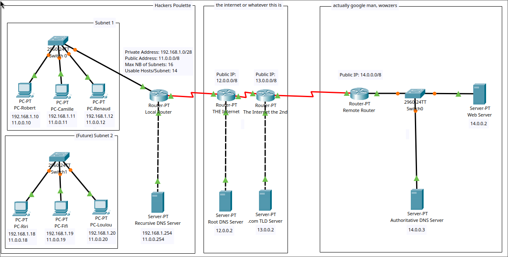
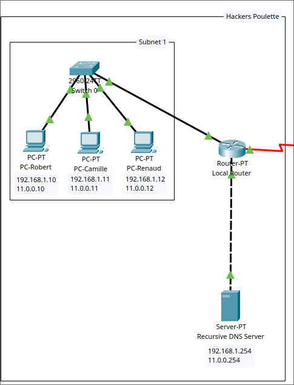
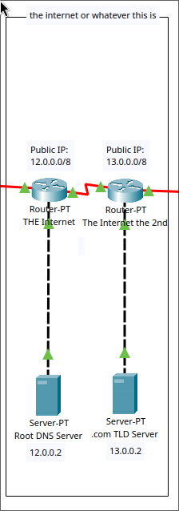
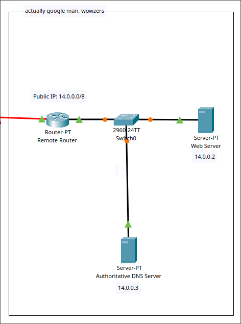
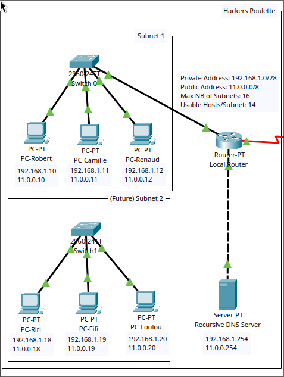

# building_a_simple_network
## The assignment
- Build a network for a young startup
- The network must be easily scalable
- Hosts must be able to communicate between each other
- Hosts must be connected to the internet

**The addressing table:**
| Devices | LAN | IP | Mask |
|---------|-----|----|------|
| PC-Robert | Eth | 192.168.1.10 | 255.255.255.0 | 
| PC-Camille | Eth | 192.168.1.11 | 255.255.255.0 |
| PC-Renaud | Eth | 192.168.1.12 | 255.255.255.0 |

**Equipments available:**
- 1 switch (Cisco 2960 with Cisco IOS version 15.0(2) image lanbasek9 or similar)
- 3 PCs (Windows 10)
- Three Ethernet cables

## Oveview

## Hackers Poulette
This is the initial setup:
- 3 PCs assigned with both private(192.168.1.0) and public(11.0.0.0) IP addresses.
- 1 2960 switch linking the end devices to the router
- 1 Router to route packets from inside and outside the network.
- 1 Local Recursive DNS to make DNS queries to the appropriate servers.

It is a pretty simple star topology that allows to add additional end devices by
connecting them to the switch. There is only one subnet here, that can allow up to 
254 hosts in total.

## The Internet
I've decided to simulate and reprensent the internet by adding two routers in the middle
between Hacker Poulette's network and a remote network(Google in this example). 

A root DNS server is connected to the first router, and .com TLD server to the second.
When we make .com DNS queries by entering a website domain name, the local DNS router, will
make his way to his registered Root DNS Server IP address(12.0.0.2) to look for the
right TLD Server's IP address(13.0.0.2). Once we get its IP address, we are going to query
this .com TLD server for the Authoritative Server's IP Address, which will then give us the 
IP address of the web server.

### Remote server
This is a remote where people from Hacker Poulette can ping and can access their websites.
There is an Authoritative DNS Server to resolve the Domain Name into the IP addresses where
the website is hosted. And then there is the Web Server hosting the website.

### Expand the network
#### The initial network setup
The network is using the network address 192.168.1.0/24 by default. Since the startup is bound 
to expand in the near future, it is a good idea to think about subnetting the network
as the team gets bigger.

#### The future
We don't know how this company is going to expand in the future, how many different teams,
and how many people per team they will have. It's hard to say now how to subnet the network.

So currently I set it up a custom mask of 255.255.255.240. This will allow the 
creation of 16 subnets and 14 usable hosts per subnet in total.

Depending on the needs of the company, we might want to reduce the number of subnets possible
and increase the number of usable hosts, or vice versa. And if the company gets so big 
that we can't fit enough hosts in this network, we might want to change the network addressing
from class C to class B to have more possibility.

